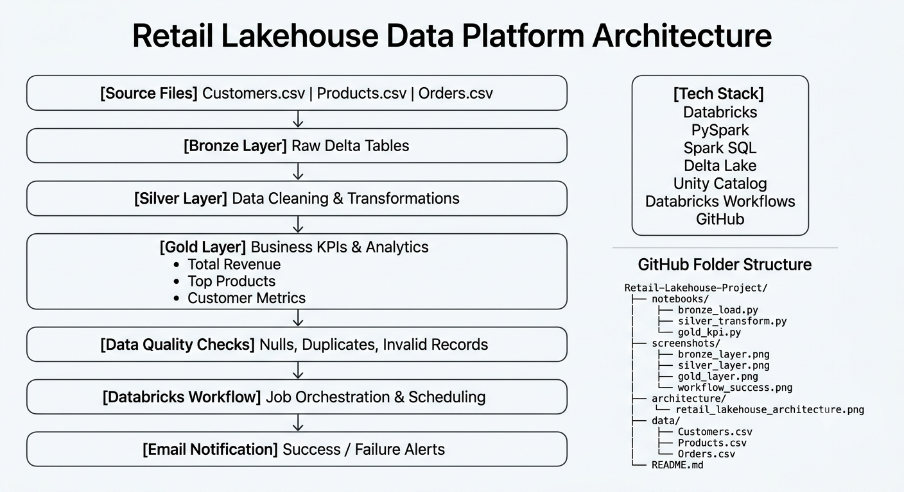

# retail-lakehouse-databricks-project

# Retail Lakehouse Data Platform using Databricks

## Project Overview

This project implements an end-to-end Retail Lakehouse Data Platform using Databricks, PySpark, Delta Lake, Unity Catalog, and Databricks Workflows following the Medallion Architecture (Bronze, Silver, Gold).

## Architecture

Raw CSV Files
↓
Bronze Layer
↓
Silver Layer
↓
Gold Layer
↓
Data Quality Validation
↓
Databricks Workflow
↓
Email Notification

## Technology Stack

- Databricks
- PySpark
- Spark SQL
- Delta Lake
- Unity Catalog
- Databricks Jobs
- GitHub

## Project Features

- Bronze Layer Data Ingestion
- Silver Layer Data Cleaning
- Gold Layer KPI Generation
- Delta Lake Tables
- Time Travel
- Incremental Load using MERGE INTO
- Data Quality Validation
- Databricks Workflow Automation
- Scheduled Job Execution
- Email Notifications

## Data Model

### Customers
- customer_id
- customer_name
- city
- signup_date

### Products
- product_id
- product_name
- category
- price

### Orders
- order_id
- customer_id
- product_id
- quantity
- order_date

## Business KPIs

- Daily Revenue
- Revenue by Category
- Top Customers
- Order Analytics

## Workflow

bronze_ingestion
↓
silver_cleaning
↓
gold_kpi_generation
↓
data_quality_validation

## Project Outcome

Successfully built an automated Databricks Lakehouse pipeline using Medallion Architecture with Delta Lake, Incremental Processing, Data Quality Checks, and Job Orchestration.

## Challenges Faced

1. DBFS root was disabled in the workspace.
   Solution: Used Unity Catalog Volumes.

2. Job workflow failed because notebooks depended on session variables.
   Solution: Refactored notebooks to be self-contained.

3. Incremental loading required MERGE INTO logic instead of overwrite operations.
   Solution: Implemented Delta Lake MERGE operations.

## Screenshots

### 1. Workflow Execution Success

Shows successful execution of the Databricks workflow including Bronze, Silver, Gold, and Data Quality tasks.

File: screenshots/workflow_success.png

### 2. Lakehouse Tables

Shows all Bronze, Silver, Gold, and Data Quality Delta tables created in the Unity Catalog schema.

File: screenshots/all_project_tables.png

### 3. Gold Daily Revenue KPI

Shows business KPI output generated from the Gold layer.

File: screenshots/gold_daily_revenue.png

### 4. Workflow DAG

Shows task dependencies between Bronze ingestion, Silver transformations, Gold KPI generation, and Data Quality validation.

File: screenshots/workflow_dag.png

## Architecture Diagram

### Pipeline Flow

Source Files → Bronze → Silver → Gold → Data Quality Checks → Databricks Workflow → Email Notification
